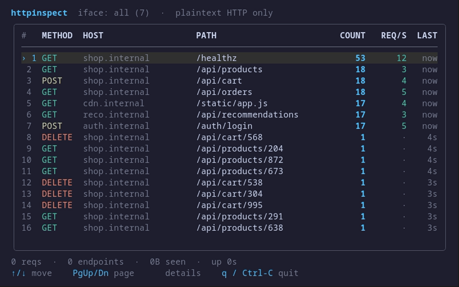

# `httpinspect`

> **`top` for the HTTP endpoints on your host.** Every plaintext HTTP request crossing the box — decoded off the wire and ranked live in your terminal by traffic, rate, and latency. No proxy, no sidecar, no app changes.

<p align="center">
  
  
  
  <a href="https://discord.gg/dYZu9PjKB"></a>
</p>

<p align="center">
  
</p>

**`httpinspect` turns the HTTP requests crossing your host into a live `top`-style table** — every endpoint sorted by traffic, with a running request count, a per-second rate, and how long ago each was last hit. Open one and you get a focused detail screen: on-the-wire latency (p50 / p95 / max), status-code mix, and req/s and latency sparklines — all built on eBPF, all reading the bytes straight off the wire.

> [!TIP]
> **No proxy, no port to point at, no app changes.** `httpinspect` attaches eBPF programs at the TC layer and reads HTTP request lines straight off the wire as packets flow through the kernel — including loopback, so requests between local services are covered too. Your traffic is never intercepted, held, or delayed.

## Quick start

```sh
curl -fsSL https://yeet.cx | sh
make            # compile bin/probe.bpf.o + bundle the JS (toolchain auto-fetched)
yeet run .      # watch every up interface, including loopback
```
[Manual install guide](https://yeet.cx/docs/install/manual-installation) | Linux only

With any plaintext HTTP flowing on the box, that's it — `httpinspect` enumerates the up interfaces, attaches at the TC layer, and starts ranking endpoints. Flags tune what it watches and how it groups (pass them after `--`, so the runtime routes them to the script):

| flag               | default        | meaning                                                              |
| ------------------ | -------------- | -------------------------------------------------------------------- |
| `--iface=<list>`   | all (wildcard) | comma-separated interface names to watch, e.g. `--iface=lo,eth0`. Unset → the daemon wildcard-attaches every host interface (this skips `lo`); naming interfaces keeps `lo`. |
| `--keep-query`     | off            | keep query strings distinct — `/x?id=1` and `/x?id=2` stay separate rows instead of collapsing into one |
| `--no-tasks`       | off            | don't attach into ECS task network namespaces (host netns only)      |
| `--task-loopback`  | off            | also hook the in-task `lo` (the 127.0.0.1 leg); best-effort, TCX-on-lo EINVALs on some kernels |
| `--reconcile-ms=N` | 5000           | how often to re-scan for ECS tasks that started or stopped           |
| `--selftest`       | off            | headless capture check — aggregate for ~4s, print counts, exit (no TUI) |

```sh
yeet run . -- --iface lo,eth0   # only these interfaces (explicit list keeps lo)
yeet run . -- --keep-query      # /x?id=1 and /x?id=2 stay separate rows
yeet run . -- --task-loopback   # also capture same-task 127.0.0.1 upstreams
```

On a host daemon, requests served from **ECS awsvpc tasks** live in each task's
own network namespace, which a host-netns attach can't reach. `httpinspect`
discovers running tasks (by their `/ecs/<taskId>` cgroup) and attaches into each
task's netns, re-scanning every `--reconcile-ms` as tasks come and go. Running
it as a sidecar inside the task instead captures that task's `eth0` + `lo`
directly.

Runs until `Ctrl-C`. Resize the terminal and the table reflows; needs a real terminal (it's a TUI — don't pipe or redirect the output).

## A 30-second primer on HTTP-on-the-wire

The mental model for what `httpinspect` reads:

**A request is text.** An HTTP/1.x request starts with a request line — `GET /path HTTP/1.1` — followed by headers, one per line, then a blank line. The very first bytes of the TCP payload *are* that line.

**The endpoint is `METHOD host path`.** The method and path come from the request line; the host comes from the `Host:` header (or the absolute-form target on a proxied/`CONNECT` request). `httpinspect` tallies traffic by that triple.

**Plaintext only.** This works because the bytes on the wire *are* the request. Under TLS (`https://`) the payload is ciphertext at this layer, so HTTPS is invisible — see the caveats.

## Common use cases

`httpinspect` is for anyone who wants a ground-truth picture of the plaintext HTTP actually crossing a host — not what an app's own access log claims it served.

- A service is slow. Which endpoint is getting hammered, and at what rate?
- You suspect a retry storm. Watch a path's `REQ/S` spike in real time.
- Auditing a box: what plaintext HTTP is actually flowing, and to which hosts?
- Local microservices talking over `lo` — see the chatter without instrumenting any of them.

## What you're looking at

```
httpinspect · iface: all (3) · plaintext HTTP only
 #  METHOD  HOST            PATH              COUNT   REQ/S   LAST
 1  GET     shop.internal   /api/products      1843    27     0s
 2  POST    auth.internal   /login              512     4      1s
 3  GET     shop.internal   /health             318     ·      3s
```

A **status bar** names the app, the interfaces being watched, and a reminder that this is plaintext HTTP only. The **table** is one row per `METHOD host path` endpoint, sorted by total count (busiest first), capped to what fits the terminal. The **footer** carries total requests, distinct endpoints, total bytes seen on the wire, and uptime.

| column   | meaning                                                          |
| -------- | --------------------------------------------------------------- |
| `#`      | rank by total count                                             |
| `METHOD` | HTTP method, color-coded (GET, POST, PUT, …)                    |
| `HOST`   | `Host:` header (or authority from an absolute-form target)      |
| `PATH`   | request path; query string collapsed unless `--keep-query`      |
| `COUNT`  | cumulative requests seen for this endpoint                      |
| `REQ/S`  | requests in the last second (`·` when idle)                     |
| `LAST`   | how long ago this endpoint was last hit                         |

Colors come from yeet's terminal styling and no-op to plain text when stdout isn't a TTY — but `httpinspect` is a TUI and needs a real terminal, so it refuses to run piped or redirected rather than render garbage.

## Navigation

The dashboard is interactive:

| key                        | action                                              |
| -------------------------- | --------------------------------------------------- |
| `↑` / `↓` (or `k` / `j`)   | move the selection up/down the endpoint list        |
| `PgUp` / `PgDn`            | jump ten rows                                       |
| `Enter`                    | open the **detail screen** for the highlighted endpoint |
| `Esc` (or `←`)             | return to the list                                  |
| `q`                        | back to the list (in detail) / quit (in the list)   |
| `Ctrl-C`                   | quit                                                |

The **detail screen** is a focused, live breakdown of one `METHOD host path` endpoint:

- total requests and its share of all traffic, current and peak req/s
- **latency** (p50 / p95 / max) — derived by pairing each response with its request on the wire (see below)
- **status codes** seen, color-coded by class (2xx/3xx/4xx/5xx)
- bytes on the wire, first/last-seen ages
- block sparklines of req/s and of recent response latency

It updates in place as new traffic arrives — no need to back out and re-enter.

## How it works

The project follows the standard yeet-script layout: `src/probes/` is the only BPF-aware code (it owns the object and exposes plain signals), `src/components/` is pure presentation that reads those signals, and `src/lib/` is pure helpers. They reference each other through the `@/` source alias; `src/main.jsx` wires them together and owns input.

```
src/bpf/httptop.bpf.c    TC programs: detect + capture HTTP segments → ringbuf
src/probes/probe.js      loads the shared BPF object, attaches TCX, exposes `control`
src/probes/httptop.js    ingest: parse, pair responses for latency, aggregate → signals
src/lib/format.js        formatters, method colors, column widths, sparkline (pure)
src/components/*.jsx     pure UI: statusbar, list, detail, footer, legend
src/main.jsx             entry: tty guard, navigation, mount, key input
bin/probe.bpf.o          the linked BPF object lands here (built by `make`)
demo/                    fake server + load generator for the recording
```

### The BPF side

A single BPF object attaches two TC (`tcx`) programs, auto-attached on `start()` by their `SEC()` names, and ships decoded events to userspace over a ring buffer:

| program      | hook           | what it captures                                                       |
| ------------ | -------------- | ---------------------------------------------------------------------- |
| `on_ingress` | `tcx/ingress`  | inbound TCP segments — requests arriving / responses returning         |
| `on_egress`  | `tcx/egress`   | outbound TCP segments — requests this host sends / responses it serves |

For each segment the program does a cheap in-kernel check on the first payload bytes: does it begin with an HTTP method token (`GET `, `POST `, …) — a **request** — or with `HTTP/` — a **response** status line? Only those two cross the ring buffer (responses capped short, since only the status line is needed); ACKs and non-HTTP traffic are dropped in the kernel. Every event carries a monotonic kernel timestamp.

The one map connecting kernel to userspace is `events` — a `RINGBUF` bound by its `btf_struct` (`http_event`), one decoded record per captured segment.

### The JS side

The dashboard runs in yeet's V8 runtime, subscribing to that ring buffer and rendering the terminal UI with `yeet:tui`:

| file                    | responsibility                                                                                   |
| ----------------------- | ------------------------------------------------------------------------------------------------ |
| `src/probes/probe.js`   | interface discovery, BPF load + TCX attach; exports the shared `control` and the iface label     |
| `src/probes/httptop.js` | request/response ingest, latency pairing, status tally, rate ticks → the `rows` / `tick` signals |
| `src/lib/format.js`     | formatters, method colors, column widths, sparkline (pure)                                       |
| `src/components/*.jsx`  | the list and endpoint-detail screens, status bar, footer, legend (pure UI reading signals)       |
| `src/main.jsx`          | tty guard, selection/navigation state, mount, key input                                          |

In userspace, each response is paired with the oldest unmatched request on the same flow — the unordered port pair, since a response travels the reverse direction. The timestamp delta is the **on-the-wire latency**, and the status line gives the **code**; both are aggregated per endpoint.

### Why TC, not a proxy or a syscall wrapper

Reading requests at the TC layer means there's nothing to point traffic through and no app to reconfigure — the programs observe and copy request segments as the kernel moves them, including loopback, so local service-to-service chatter is covered without instrumenting anything. And because the method/`HTTP/` check happens in the kernel, ACKs and non-HTTP traffic never cost a ring-buffer write.

## Building from source

```sh
make           # build bin/probe.bpf.o (clang + bpftool) + bundle the JS (esbuild)
make bpf       # just the BPF object
make bundle    # just the JS bundle (src/main.jsx -> src/index.jsx)
make clean     # remove build artifacts
```

`make` runs two independent compilers: **clang + bpftool** compile every `src/bpf/*.bpf.c` and link them into one loadable object `bin/probe.bpf.o`; **esbuild** bundles `src/main.jsx` into `src/index.jsx`, resolving the `@/` alias and leaving `yeet:*` builtins external. The toolchain (clang, bpftool, esbuild) is fetched into a per-machine cache on first build — no system C/BPF toolchain and no Node/npm required. The generated CO-RE header `src/bpf/include/vmlinux.h` and `bin/` are build artifacts (gitignored).

`#/` (project root) and `@/` (source root) are **bundle-time aliases** that esbuild resolves via `tsconfig` `paths`; the runtime resolver doesn't know them, which is why the BPF object is located with `import.meta.dirname` in `probes/probe.js`.

## Testing across kernels

A BPF program that loads on your laptop can be rejected by an older kernel's verifier. Run `make veristat` to load `bin/probe.bpf.o` with veristat on **your** kernel — a quick check that every program passes, plus per-program complexity. Loading programs needs privileges, so use `sudo`.

`.github/workflows/kernel-matrix.yml` runs the same check across a matrix of kernels in CI (booting each in a VM and running veristat against the object), and `make veristat-matrix` runs that matrix locally on Linux + KVM. See the comments in `build/bpf.mk` for tuning the kernel set.

## Try it without real traffic

`demo/` is a self-contained traffic source so you can see the dashboard fill on a quiet box:

```sh
python3 demo/server.py &            # fake plaintext-HTTP server on 127.0.0.1:8731
PORT=8731 bash demo/traffic.sh      # steady, weighted request mix over loopback
yeet run . -- --iface lo            # watch it on loopback
```

`demo/record.sh` drives the same setup under `termgif` to regenerate `assets/http-endpoint.gif`.

## Requirements

> [!IMPORTANT]
> Linux with **BTF** (`CONFIG_DEBUG_INFO_BTF=y`) — needed to generate `vmlinux.h` and for the TC context structs the programs read. Default on current Arch, Fedora, Ubuntu, and Debian 12+. CO-RE means no per-kernel recompile.
>
> A reasonably recent kernel with **TCX** support (`tcx` links, Linux 6.6+), plus the yeet daemon, which handles the privileged BPF load. `curl -fsSL https://yeet.cx | sh` installs it.

## Honest caveats

> [!NOTE]
> `httpinspect` is observability, not enforcement. It tells you what crossed the wire; it does not stop, hold, or modify anything.

- **Plaintext HTTP only.** TLS payloads are ciphertext at this layer, so HTTPS is invisible. Capturing it would need a uprobe on `SSL_write`/`SSL_read`, which is a different tool. ([contact us](https://yeet.cx/?utm_source=github&utm_medium=readme&utm_campaign=httpinspect&utm_content=caveats-tls) for custom yeet scripts)
- Only the captured prefix (512 bytes) of each request is parsed — enough for the request line and `Host` header, which is all the table needs.
- **Latency is on-the-wire, not server-internal.** It's the time between the request and response segments as seen at this host's TC layer, so it includes network RTT for remote hosts. Responses are paired to requests FIFO per flow, which is correct for ordered HTTP/1.x but approximate under pipelining; unmatched requests are dropped after 10s.
- Loopback packets are seen twice (egress and ingress on `lo`); identical 4-tuple+seq sightings are de-duplicated so they're not double-counted.
- Under heavy load or a slow link, some segments may not be captured, so counts are a close lower bound rather than an exact tally.
- IPv6 packets carrying TCP behind extension-header chains (rare) are skipped.

## Community questions

**Does this need a proxy or a sidecar?**
No. `httpinspect` reads requests off the wire from inside the kernel's TC layer, so there's nothing to point traffic through and no app to reconfigure.

**Will it slow down or intercept my traffic?**
No. The programs observe and copy request segments; they don't hold, modify, or redirect packets.

**Why don't I see my HTTPS traffic?**
Because it's encrypted before it hits the wire. At the TC layer the payload is ciphertext, so there's no request line to parse. That's a fundamental limit of capturing here, not a bug.

**Why is a local service showing as `127.0.0.1:port`?**
That's the `Host:` header the client sent. Services addressed by name show their name; those addressed by IP show the IP.

**Can I get a quick check without the full TUI?**
Yes. `yeet run . -- --selftest` attaches the probe (host + each ECS task netns), aggregates for ~4s, and prints the counts before exiting — a headless sanity check of the capture + parse pipeline. (It's a flag, not a separate entry: `yeet run` bundles the whole app into one `src/index.jsx`, so `import.meta.main` can't distinguish the probe from the app.)

## License

GPL-2.0. The BPF program declares `char LICENSE[] SEC("license") = "GPL"` in [`src/bpf/httptop.bpf.c`](src/bpf/httptop.bpf.c), required for the kernel helpers it uses.

---

Built with [yeet](https://yeet.cx/docs/?utm_source=github&utm_medium=readme&utm_campaign=httpinspect), a JS runtime for writing eBPF programs and live system dashboards on Linux. Join us on [discord](https://discord.gg/dYZu9PjKB?utm_source=github&utm_medium=readme&utm_campaign=httpinspect).
